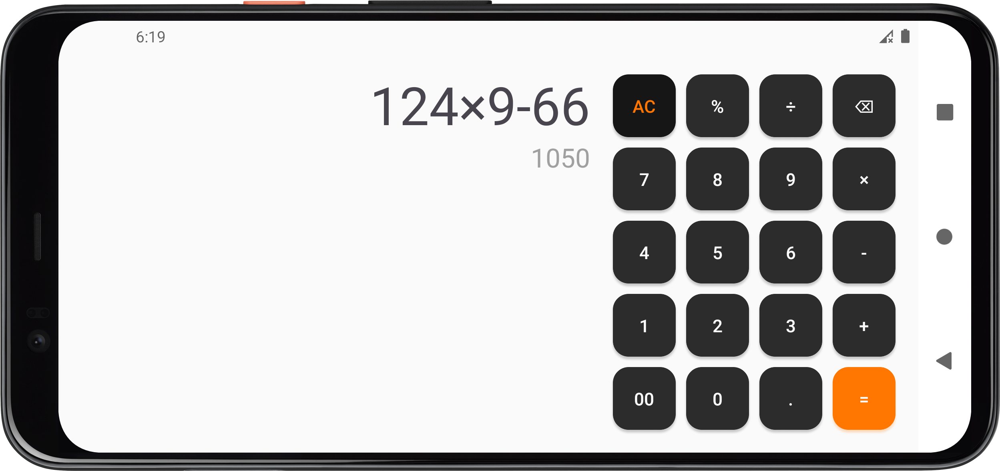
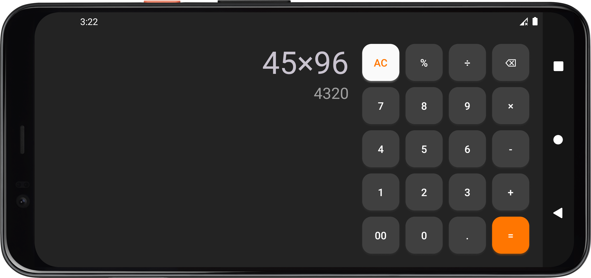

# Calculator App

# 

A simple and user-friendly calculator app build with Kotlin for android. It supports basic arithmetic operations, ensures clean input validation, and offers a responsive, interactive interface. This app is optimized to work well on phones and tablets, in both portrait and landscape modes, with support for light and dark themes.

---

## ✨ Features

- Performs basic arithmetic operations: Addition, Subtraction, Division, Multiplication, Modulo
- Light and dark theme support (auto-switches with system settings)
- Supports both portrait and landscape orientation
- Optimized for mobile phones and tablets
- Input validation to prevent invalid expressions
- Fast responsive and smooth user experience
- Clean and intuitive UI

---

## 📸 Screenshots

### Phone Portrait Mode

<table align="center">
    <tr> 
    <th align="center">Light Mode</th> 
    <th align="center">Dark Mode</th> 
  </tr> 
  <tr>
    <td>
      
    </td>
    <td>
        
    </td>
  </tr>
</table>
 

### Phone Landscape Mode

<table align="center"> 
  <tr> 
    <th align="center">Light Mode</th> 
  </tr> 
  <tr> 
    <td align="center"> 
       
    </td> 
  </tr> 
  <tr> 
    <th align="center">Dark Mode</th> 
  </tr> 
  <tr> 
    <td align="center"> 
       
    </td> 
  </tr> 
</table>
 

### Tab Portrait/Landscape Mode

<table align="center"> 
  <tr> 
    <th align="center">Portrait Mode</th> 
  </tr> 
  <tr> 
    <td align="center"> 
       
    </td> 
  </tr> 
  <tr> 
    <th align="center">Landscape Mode</th> 
  </tr> 
  <tr> 
    <td align="center"> 
       
    </td> 
  </tr> 
</table>

---

## 🛠️ Tech Stack

- Kotlin
- XML
- Android SDK

---

## 📱 Compatibility

| Device | Orientation        | Theme        |
| ------ | ------------------ | ------------ |
| Phone  | Portrait/Landscape | Light / Dark |
| Tablet | Portrait/Landscape | Light / Dark |
